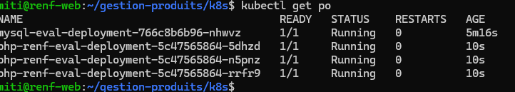
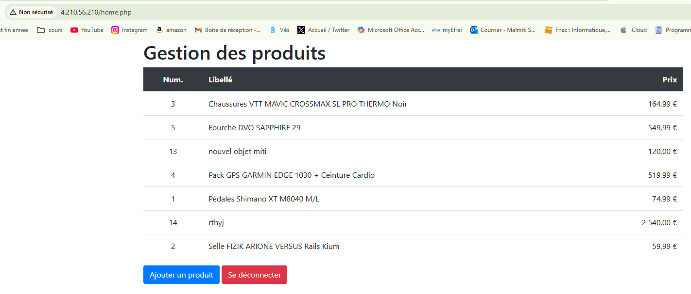

## partie 1
### commandes 

#### construire les images
- docker build -t 20220796/mysql-renf-eval:latest ./database
- docker build -t 20220796/php-renf-eval:latest ./php

#### pousser les images sur le registry
- docker push 20220796/mysql-renf-eval:latest
- docker push 20220796/php-renf-eval:latest

#### lancer le docker compose
- docker compose build (facultatif)
- docker compose up -d

### url des images
php : https://hub.docker.com/r/20220796/php-renf-eval

mysql : https://hub.docker.com/r/20220796/mysql-renf-eval

## partie 2

### Le cluster k8s
Le cluster a été créé sur Azure Cloud. Afin d'y accéder, j'ai téléchargé le kubeconfig et l'ai mis dans ~/.kube/config-az. J'ai enfin set la variable d'environnement kubeconfig pour pointer vers ce fichier avec
export KUBECONFIG=$HOME/.kube/config-az.

### scalabilité

### déploiement

## partie 3