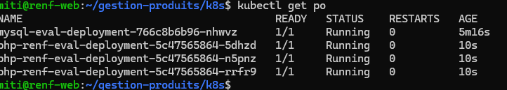
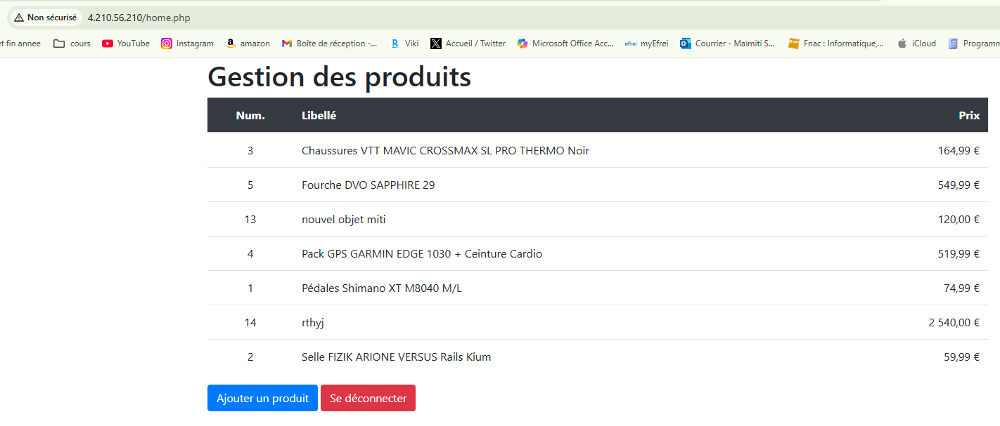

# Renforcement Développement Web

#### Maimiti Saint-Marc
#### M1 dev - octobre 2025
---

## Partie 1: Conteneurisation avec Docker
### commandes pour construire les images

1) Construire les images

```bash
docker build -t 20220796/mysql-renf-eval:latest ./database
docker build -t 20220796/php-renf-eval:latest ./php
```

Ces commandes vont permettre de construire les images à partir des Dockerfiles locaux (emplacements ./php et ./database). le nom de l'image est composé de trois parties. La première "20220796" correspond au registry sur lequel les images pourront être poussées. Ensuite, la partie "mysql-renf-eval" qui correspond tout simplement le nom de l'image. Enfin, on attribue un tag à l'image, ici "latest".

2) Pousser les images sur le registry

```bash
docker push 20220796/mysql-renf-eval:latest
docker push 20220796/php-renf-eval:latest
```

Ici, nous allons pousser les images sur le registry 20220796. Il faut avant de pouvoir pousser une image exécuter la commande `docker login` pour pouvoir s'identifier au Docker Hub.

3) Lancer le docker compose

```bash
docker compose build (facultatif)
docker compose up -d
```

La première commande est facultative car elle permet de construire toutes les images renseignées dans le fichier docker-compose. La seconde commande permet de lancer le docker compose, en arrière plan grace à la commande `-d`.


### Url des images poussées sur Dockere Hub
- L'image php-renf-eval : https://hub.docker.com/r/20220796/php-renf-eval

- L'image mysql-renf-eval : https://hub.docker.com/r/20220796/mysql-renf-eval

## Partie 2: Orchestration avec Kubernetes

### Le cluster k8s
Le cluster a été créé sur Azure Cloud. Afin d'y accéder, j'ai téléchargé le fichier kubeconfig et l'ai mis dans ~/.kube/config-az. J'ai enfin instancié la variable d'environnement kubeconfig pour pointer vers ce fichier avec
`export KUBECONFIG=$HOME/.kube/config-az`.

### Scalabilité

Ici, le déploiement php-renf-eval-deployment possède trois réplicas donc trois pods ont été créé.

### Déploiement

Lorsque l'on accède à l'ip du service, on arrive bien sur l'application et les données sont bien persistantes grace aux PV et PVC

## Partie 3: CI/CD

La partie CI/CD a été effectuée sur GitHub Action

